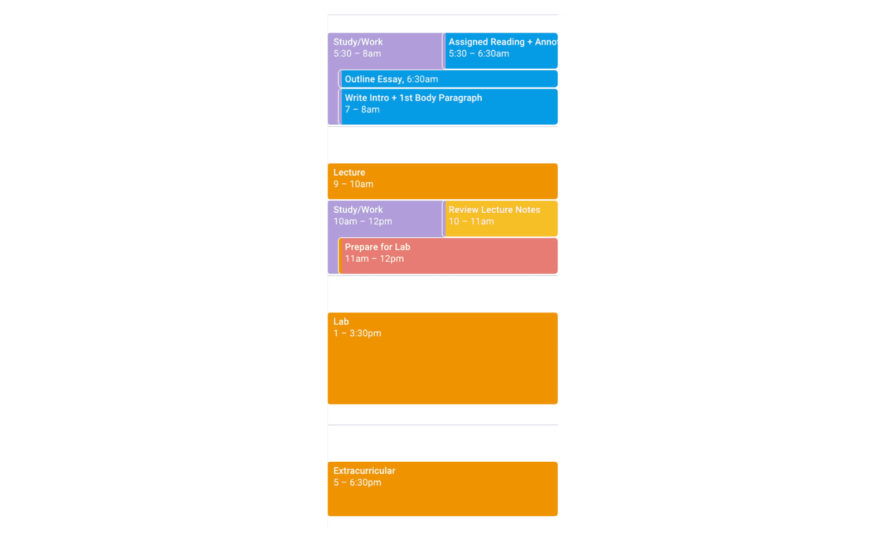
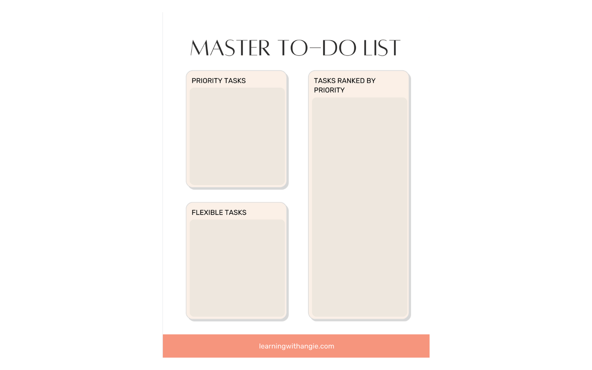
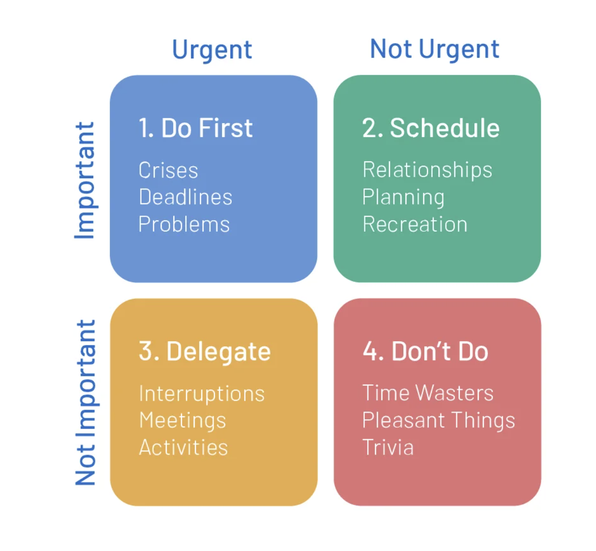

### DM-UY 1143 Ideation and Prototyping

# Time Management: Time Blocking & Task Management

## Time Blocking

Time Block is a time management system where you look at your weekly (or daily) schedule and consider it in Time Blocks. This [link](https://learningwithangie.com/time-blocking-method-for-students/) has a great walk through with visuals.

1. Look at your week and put in all your critical tasks, like classes and work (job). We'll refer to these as obligations. Block them in for the time span that they require.

2. Then add in your daily routines, like, waking & sleeping, and personal care. Block them in for the time span that they require.

3. Now look at all the tasks you need to do, and prioritize them. 

Think about the critical tasks that need to be resolved. These are your priorities. Remember how we broken them down into subtasks. Break them into subtasks.

Think about your flexible tasks. Break these into subtasks.

These tasks could/would also include studying and homework.

Rank the priority of all the tasks & subtasks. 

Stephen Covey created a matrix for his tasks based on their level of importance and urgency.

Note that a particular task may move between quadrants as time moves ahead.

4. Add your study time/university work time in across your open blocks. Block them in for the time span that they require.

5. Then, go back into the study/work blocks and "time boxing" your study/work tasks

By time blocking and time boxing with your tasks, you can more easily see your availablity and the timem you have.

