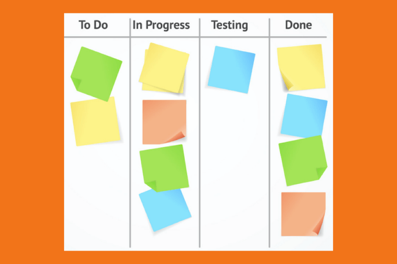
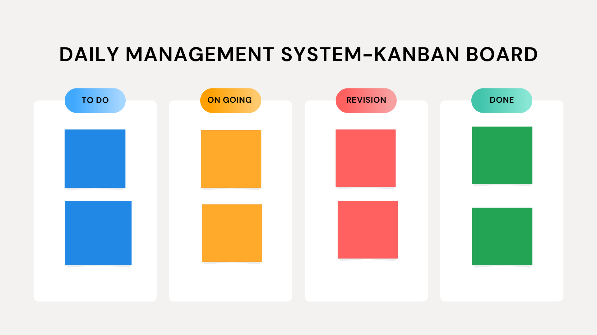

### DM-UY 1143 Ideation and Prototyping

# Time Management: Time Blocking & Task Management

## The KanBan System

### Introduction

The KanBan Time Management is a visual system to track tasks through stages: To do, Doing, Done. The goal is to improve workflow efficiency and productivity. A key aspect, is to limit the number of tasks in the "Doing" list, in order to manage focus, concentration and stress. One can also modify these lists to have additional ones, should it be appropriate. For example, "Waiting" might be a list with items that are waiting to hear back from some one else before moving on to the next stage. Another key aspect to this system is to move an item back to the "to-do" if the task is not complete. Thus, tasks can move from the "to-do" to the "doing" back to the "to-do", etc, etc. 

# Method

There are many ways to create a KanBan system. Some students use post-it notes on a wall in their room, some use a white board, some use a note book with post-it notes. Some use a digital format from a variety of different software providers and browser extensions. Find the one that makes the most sense for you. It should be something that you will see/look at, and offer flexibility in moving entries around, as well as having multiple entries.

Here is one from Toyota:

Here is one also tracking revision.

The key, is to ONLY have two or three tasks that you are working on, on a given day and a given time. It's been shown that having 3 medium tasks a day (or 1 big task, or 5 small tasks) is a good gauge to avoid being overwhelmed and burnout.

It's also quite helpful to see the "Completed" task lists! :)
